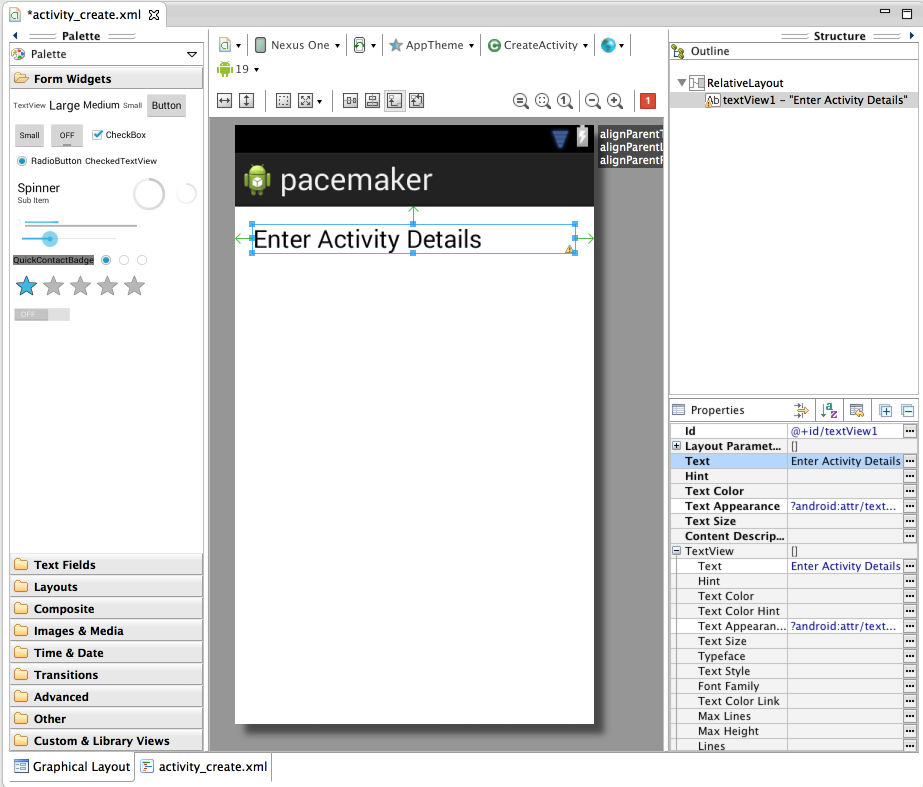
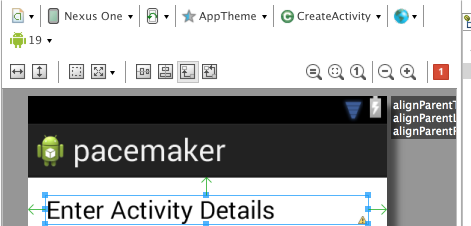
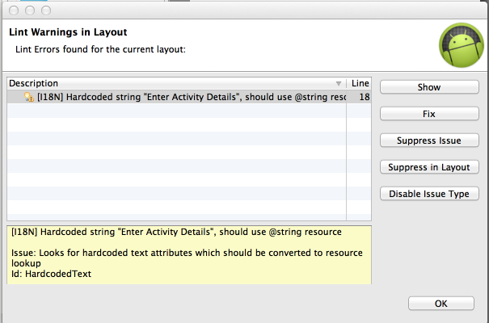

#Layout Donation Activity

For this lab, out objective is to reproduce in Android this feature from this web app:

In eclipse, delete the current 'Hello World' text, and drag and drop a new'LargeText' form widget onto the canvas. Look closely at the following:

Note carefully the following features:

- the guides tyeing the text to the left, top and right corner
- in Outline - the name of the control has been changed from a default to 'donateTitle'. This is changed by selecting the item in outline, and selecting 'Edit ID' from the context menu.
- in Properties - where we entered 'Welcome Homer' into the text field

Recreate the above precisely.

A 'Lint warning' will have popped up in the top right:

Click on this:

.. and select 'Fix' - this is inviting us to give a name to the string, which will be stored in a separate 'string.xml' file. Give it the name 'donateTitle':

Save everything - and the lint warning should (eventually) disappear.

Locate the following two files and inspect them closely:

##res/layout/activity_dontate.xml

~~~xml
<RelativeLayout xmlns:android="http://schemas.android.com/apk/res/android"
    xmlns:tools="http://schemas.android.com/tools"
    android:layout_width="match_parent"
    android:layout_height="match_parent"
    android:paddingBottom="@dimen/activity_vertical_margin"
    android:paddingLeft="@dimen/activity_horizontal_margin"
    android:paddingRight="@dimen/activity_horizontal_margin"
    android:paddingTop="@dimen/activity_vertical_margin"
    tools:context=".CreateActivity" >

    <TextView
        android:id="@+id/textView1"
        android:layout_width="wrap_content"
        android:layout_height="wrap_content"
        android:layout_alignParentLeft="true"
        android:layout_alignParentRight="true"
        android:layout_alignParentTop="true"
        android:text="@string/CreateActivityTitle"
        android:textAppearance="?android:attr/textAppearanceLarge" />

</RelativeLayout>
~~~

##res/values/strings.xml
~~~xml
<?xml version="1.0" encoding="utf-8"?>
<resources>

    <string name="app_name">pacemaker</string>
    <string name="action_settings">Settings</string>
    <string name="hello_world">Hello world!</string>
    <string name="CreateActivityTitle">Enter Activity Details</string>

</resources>

~~~

Note the relationship between 'donateTitle' in both files. Also note we have a superfluous 'hello_world' string left over from the generated app. We can delete this now.

