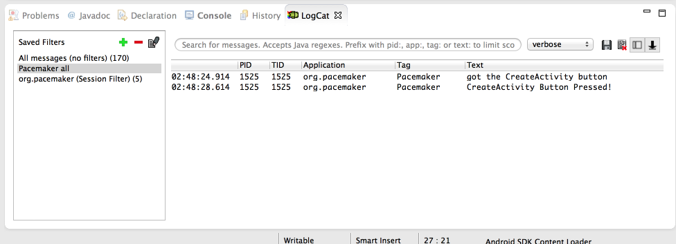

#Documentation

The android documentation is particularly helpful and well designed. These are the two key starting points:

- <http://developer.android.com/guide/components/index.html>
- <http://developer.android.com/reference/packages.html>

The first is designed to be read though as a guide, perhaps independent of any work in eclipse. You should get into the habit of devoting an hour or two a week just reading this section.

The Reference guide should always be open as you are working on labs or projects, and you should make a serious effort to get to grips with at least some of the information here.

Taking the Button class we have just started using. We can immediately find the reference just by knowing the import statement in our Activity class:

~~~java
import android.widget.Button;
~~~

.. translates to

- <http://developer.android.com/reference/android/widget/Button.html>

(note the last three segments match the package name). Open this page now. Read just as far as the "Button Style" heading. There seems to be two ways of learning when an button event occurs. The first method is using the event handler/listener - but a second easier method is also available.

Try this now. Bring in a new method into Donate class:

~~~java
  public void createActivityButtonPressed (View view) 
  {
    Log.v("Donate", "CreateActivity Button Pressed!");
  }
~~~

Then, edit the activity_donate xml file - and add a new attribute into the Button xml fragment:

~~~xml
    <Button
        android:id="@+id/createActivityButton"
        android:layout_width="wrap_content"
        android:layout_height="wrap_content"
        android:layout_alignParentBottom="true"
        android:layout_centerHorizontal="true"
        android:layout_marginBottom="22dp"
        android:text="@string/createActivityButton" 
        android:onClick="createActivityButtonPressed"/>
~~~

(the very last entry)

Save everything and execute the app, and monitor the log as you press the button:

We now have our first interaction working!

