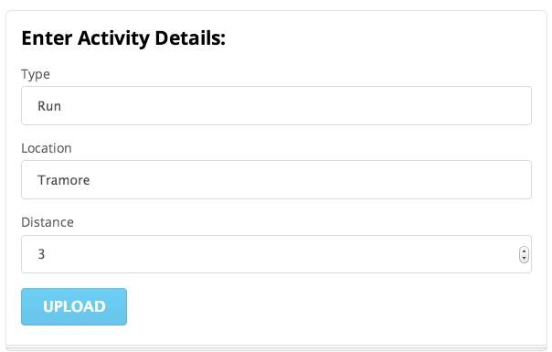
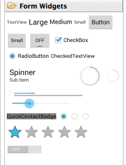
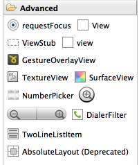
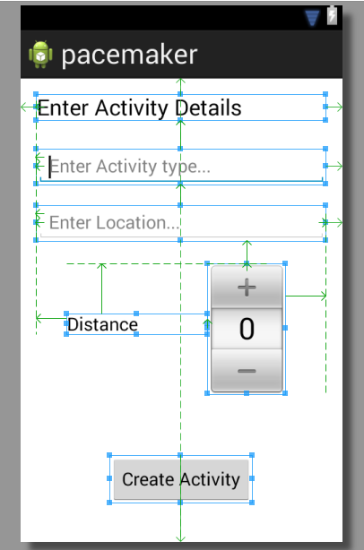
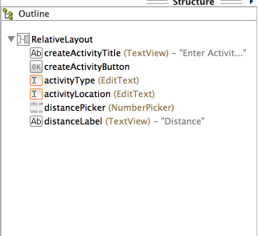

#Research + New Control Layout

Recall the UI we are trying to implement:

We need a Radio Buttons, some sort of selection/combo box + a progress bar. These can be found in various locations in the pallette:

RadioGroup, ProgressBar and NumberPicker seem likely candidates. The names of these controls are exactly as advertised, and we can expect them to be in the 'widgets' package. To verify this, try importing them at the top of the Donate activity class:

~~~java
import android.widget.NumberPicker;
import android.widget.TextView;
~~~

... and we can bring in three fields into the class:

~~~java
  private Button       createActivityButton;
  private TextView     activityType;
  private TextView     activityLoction;
  private NumberPicker distancePicker;
~~~

We can also open up three pages of documentation - which we can reverse engineer from the package/class names:

- <http://developer.android.com/reference/android/widget/RadioGroup.html>
- <http://developer.android.com/reference/android/widget/ProgressBar.html>
- <http://developer.android.com/reference/android/widget/NumberPicker.html>

Note this time we have gone to the Activity class before actually creating the controls. We should do this now - and remember to use the same names (for the IDs) as we create the controls.

Getting the layout +id names as shown above may take some practice. However, it is an essential skill to get on top of, even it it takes a lot of trial and error.

For reference purposes (try to do it your self), these are the relevant generated xml files:

~~~xml
<RelativeLayout xmlns:android="http://schemas.android.com/apk/res/android"
    xmlns:tools="http://schemas.android.com/tools"
    android:layout_width="match_parent"
    android:layout_height="match_parent"
    android:paddingBottom="@dimen/activity_vertical_margin"
    android:paddingLeft="@dimen/activity_horizontal_margin"
    android:paddingRight="@dimen/activity_horizontal_margin"
    android:paddingTop="@dimen/activity_vertical_margin"
    tools:context=".CreateActivity" >

    <TextView
        android:id="@+id/createActivityTitle"
        android:layout_width="wrap_content"
        android:layout_height="wrap_content"
        android:layout_alignParentLeft="true"
        android:layout_alignParentRight="true"
        android:layout_alignParentTop="true"
        android:text="@string/createActivityTitle"
        android:textAppearance="?android:attr/textAppearanceLarge" />

    <Button
        android:id="@+id/createActivityButton"
        android:layout_width="wrap_content"
        android:layout_height="wrap_content"
        android:layout_alignParentBottom="true"
        android:layout_centerHorizontal="true"
        android:layout_marginBottom="22dp"
        android:text="@string/createActivityButton" 
        android:onClick="createActivityButtonPressed"/>

    <EditText
        android:id="@+id/activityType"
        android:layout_width="wrap_content"
        android:layout_height="wrap_content"
        android:layout_alignLeft="@+id/createActivityTitle"
        android:layout_alignParentRight="true"
        android:layout_below="@+id/createActivityTitle"
        android:layout_marginTop="27dp"
        android:ems="10"
        android:hint="@string/activityTypeHint" >

        <requestFocus />
    </EditText>

    <EditText
        android:id="@+id/activityLocation"
        android:layout_width="wrap_content"
        android:layout_height="wrap_content"
        android:layout_alignLeft="@+id/activityType"
        android:layout_alignParentRight="true"
        android:layout_below="@+id/activityType"
        android:layout_marginTop="20dp"
        android:ems="10"
        android:hint="@string/activityLocationHint" />

    <NumberPicker
        android:id="@+id/distancePicker"
        android:layout_width="wrap_content"
        android:layout_height="wrap_content"
        android:layout_alignRight="@+id/activityLocation"
        android:layout_below="@+id/activityLocation"
        android:layout_marginRight="40dp"
        android:layout_marginTop="22dp" />

    <TextView
        android:id="@+id/distanceLabel"
        android:layout_width="wrap_content"
        android:layout_height="wrap_content"
        android:layout_alignLeft="@+id/activityLocation"
        android:layout_alignTop="@+id/distancePicker"
        android:layout_marginLeft="30dp"
        android:layout_marginTop="50dp"
        android:layout_toLeftOf="@+id/distancePicker"
        android:text="@string/distanceLabel"
        android:textAppearance="?android:attr/textAppearanceMedium" />

</RelativeLayout>
~~~

~~~xml
<?xml version="1.0" encoding="utf-8"?>
<resources>

    <string name="app_name">pacemaker</string>
    <string name="action_settings">Settings</string>
    <string name="createActivityTitle">Enter Activity Details</string>
    <string name="createActivityButton">Create Activity</string>
    <string name="activityTypeHint">Enter Activity type...</string>
    <string name="activityLocationHint">Enter Location...</string>
    <string name="distanceLabel">Distance</string>

</resources>
~~~

If we have our naming conventions right - then we can bind to these new controls in onCreate:

~~~java
    createActivityButton = (Button)       findViewById(R.id.createActivityButton);
    activityType         = (TextView)     findViewById(R.id.activityType);
    activityLocation     = (TextView)     findViewById(R.id.activityLocation);
    distancePicker       = (NumberPicker) findViewById(R.id.distancePicker);
~~~

This is the complete Donate class:

~~~java
package org.pacemaker;

import android.os.Bundle;
import android.app.Activity;
import android.util.Log;
import android.view.Menu;
import android.view.View;
import android.widget.Button;
import android.widget.NumberPicker;
import android.widget.TextView;

public class CreateActivity extends Activity
{
  private Button       createActivityButton;
  private TextView     activityType;
  private TextView     activityLocation;
  private NumberPicker distancePicker;
  
  @Override
  protected void onCreate(Bundle savedInstanceState)
  {
    super.onCreate(savedInstanceState);
    setContentView(R.layout.activity_create);
    
    createActivityButton = (Button)       findViewById(R.id.createActivityButton);
    activityType         = (TextView)     findViewById(R.id.activityType);
    activityLocation     = (TextView)     findViewById(R.id.activityLocation);
    distancePicker       = (NumberPicker) findViewById(R.id.distancePicker);
  }
  
  public void createActivityButtonPressed (View view) 
  {
    Log.v("Pacemaker", "CreateActivity Button Pressed!");
  }

  @Override
  public boolean onCreateOptionsMenu(Menu menu)
  {
    // Inflate the menu; this adds items to the action bar if it is present.
    getMenuInflater().inflate(R.menu.create, menu);
    return true;
  }
}
~~~

