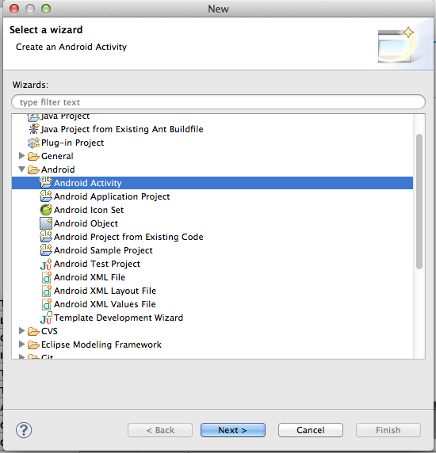
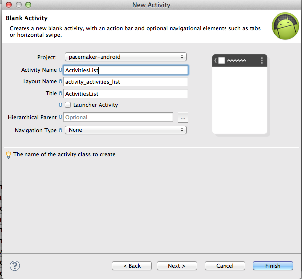
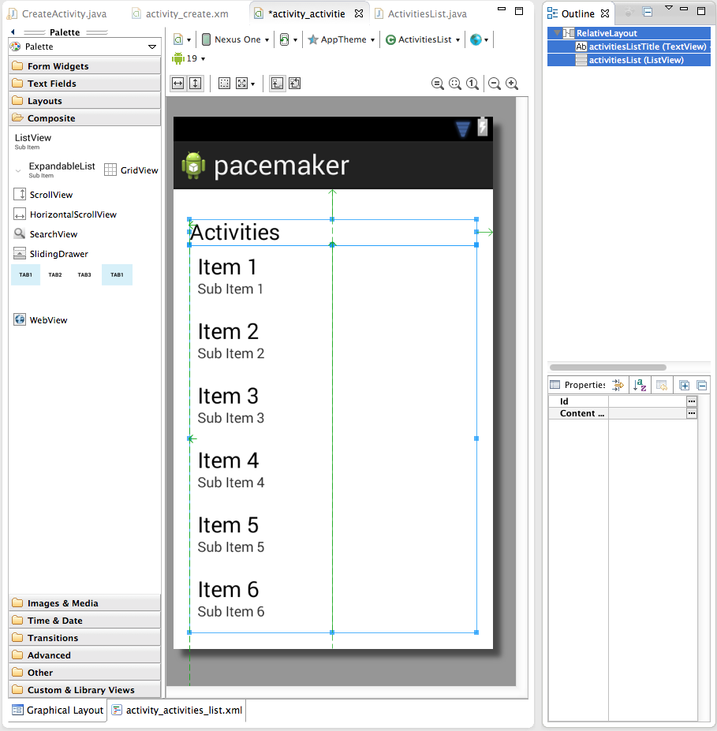

#List Activities

We would like to display the activities we have just created, mirroring the approach taken by the web application:

Select the package containing the CreateActivity class, and create a new activity using the wizard (New->Android->Android Activity:

Accept all the defaults, and call the activity ActivitiesList:

In the designer, place a Large Text Field + a ListView (from the Composite panel) directly on to the canvas like this:

Note the names used for the IDs in the Outline view.

