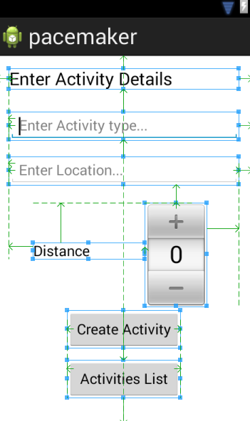

#Rendering the Activities

Place a new button on the CreateAvtivity panel to trigger the display of the activities list:

... and install an event handler for this button:

~~~java
  public void listActivityButtonPressed (View view) 
  {
    Log.v("Pacemaker", "List Activities Button Pressed");
  }
~~~

Manually 'wire-up' the event handler by inserting the appropriate entry in the layout file:

~~~xml
    <Button
        android:id="@+id/avtivitiesListButton"
        android:layout_width="wrap_content"
        android:layout_height="wrap_content"
        android:layout_alignLeft="@+id/createActivityButton"
        android:layout_alignParentBottom="true"
        android:layout_alignRight="@+id/createActivityButton"
        android:layout_marginBottom="16dp"
        android:onClick="listActivityButtonPressed"
        android:text="@string/activities_list" />
~~~

(second last entry)

To switch views, we start a new activity with the correct intent:

~~~
  public void listActivityButtonPressed (View view) 
  {
    Log.v("Pacemaker", "List Activityies Button Pressed");
    Intent intent = new Intent(this, ActivitiesList.class);
    startActivity (intent);
  }
~~~